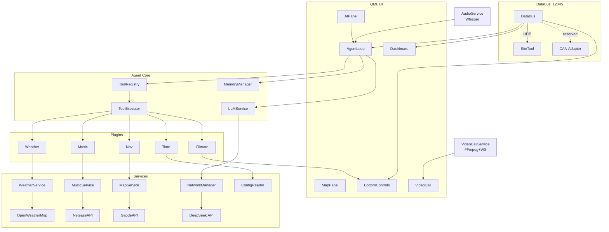
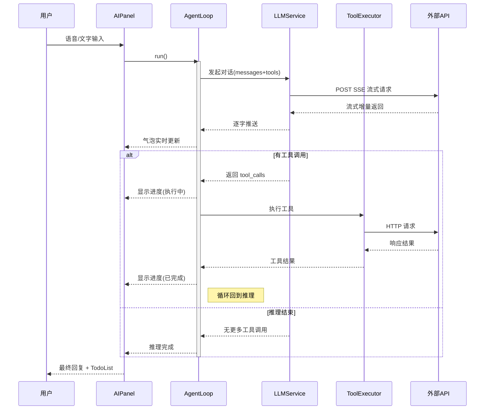
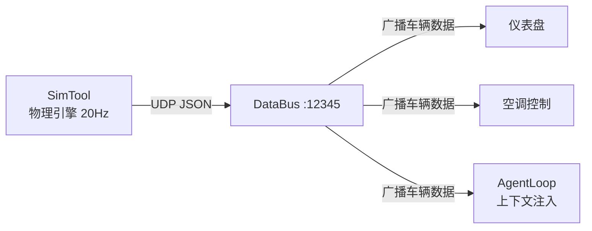
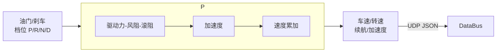
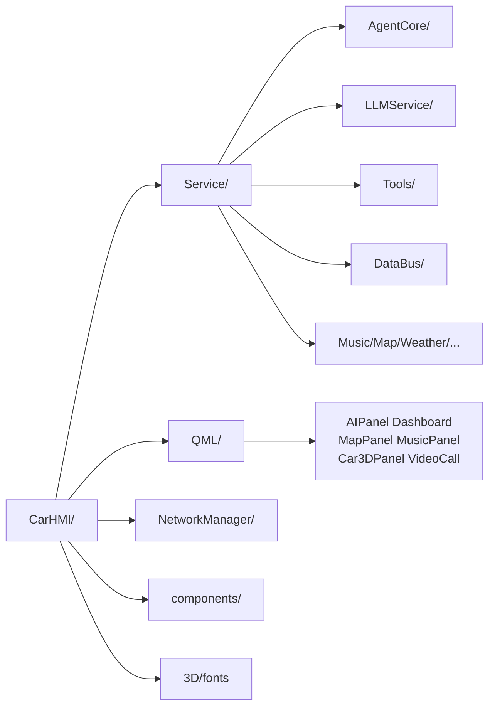

# CarHMI 架构

## 整体架构



## Agent ReAct 循环



## 数据总线



## 插件体系

```mermaid
classDiagram
    direction LR
    AgentTool : +name()
    AgentTool : +description()
    AgentTool : +schema()
    AgentTool : +execute()

    AgentTool &lt;|-- TimeTool : get_current_time
    AgentTool &lt;|-- WeatherTool : get_weather
    AgentTool &lt;|-- MusicTool : play_music
    AgentTool &lt;|-- ClimateTool : control_ac
    AgentTool &lt;|-- NavTool : search_nav

    ToolRegistry o-- AgentTool
    ToolExecutor --> ToolRegistry
```

## SimTool 物理



## 目录结构


