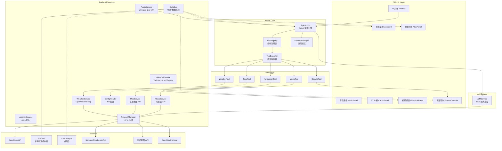
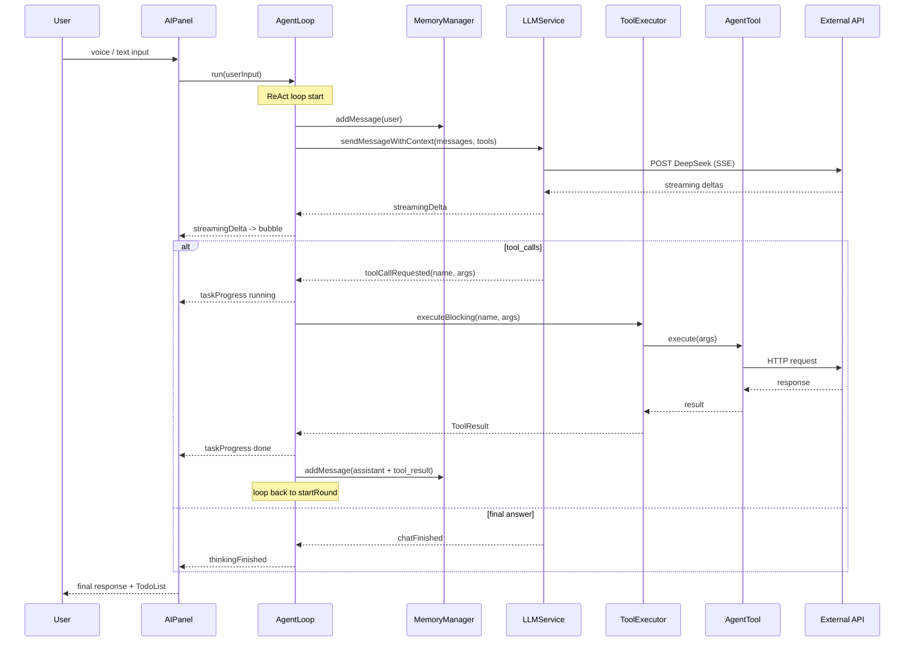
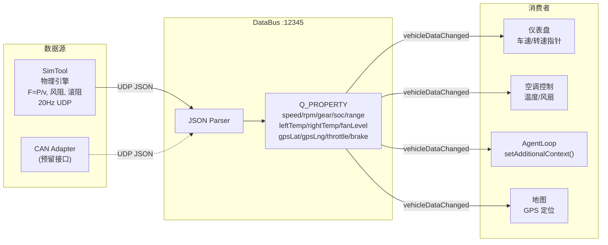
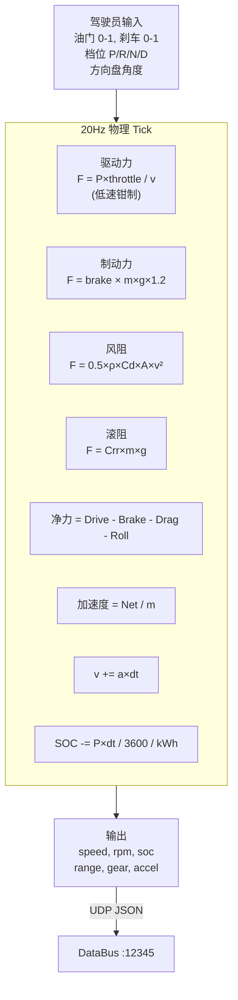

# CarHMI 架构

## 整体架构



## Agent ReAct 循环



## 数据总线 (DataBus)



## 工具插件体系

```mermaid
classDiagram
    class AgentTool {
        &lt;&lt;abstract&gt;&gt;
        +name() string
        +description() string
        +parametersSchema() json
        +execute(args) future
    }

    class ToolRegistry {
        +registerTool()
        +findTool()
        +toOpenAISchema()
    }

    class ToolExecutor {
        +executeBlocking()
    }

    class TimeTool {
        get_current_time
    }

    class WeatherTool {
        get_weather
    }

    class MusicTool {
        play_music
    }

    class ClimateTool {
        control_air_conditioner
    }

    class NavigationTool {
        search_navigation
    }

    AgentTool &lt;|-- TimeTool
    AgentTool &lt;|-- WeatherTool
    AgentTool &lt;|-- MusicTool
    AgentTool &lt;|-- ClimateTool
    AgentTool &lt;|-- NavigationTool
    ToolRegistry o-- AgentTool
    ToolExecutor --&gt; ToolRegistry
```

## SimTool 物理模型



## 目录结构

```mermaid
graph TB
    Root["CarHMI/"]
    Root --> Service["Service/"]
    Root --> QML["QML/"]
    Root --> Network["NetworkManager/"]
    Root --> Components["components/"]
    Root --> SimToolDir["../SimTool/"]
    Root --> Assets["3D Models & Fonts"]

    Service --> AgentCore["AgentCore/<br/>AgentLoop, ToolRegistry<br/>ToolExecutor, MemoryManager"]
    Service --> LLM["LLMService/"]
    Service --> Tools["Tools/<br/>5 个内置插件"]
    Service --> DataBusDir["DataBus/"]
    Service --> Music["MusicService/"]
    Service --> Map["MapService/"]
    Service --> Weather["WeatherService/"]
    Service --> Location["LocationService/"]
    Service --> Audio["AudioService/"]
    Service --> Video["VideoCallService/"]
    Service --> Config["ConfigReader/"]

    QML --> MAIN["MAIN/main.qml"]
    QML --> Panels["AIPanel, Dashboard<br/>MapPanel, MusicPanel<br/>CarPanel, Car3DPanel<br/>VideoCallPanel<br/>BottomControls"]
    QML --> Bars["Sidebar, StatusBar"]
    QML --> Fonts["fonts/"]
